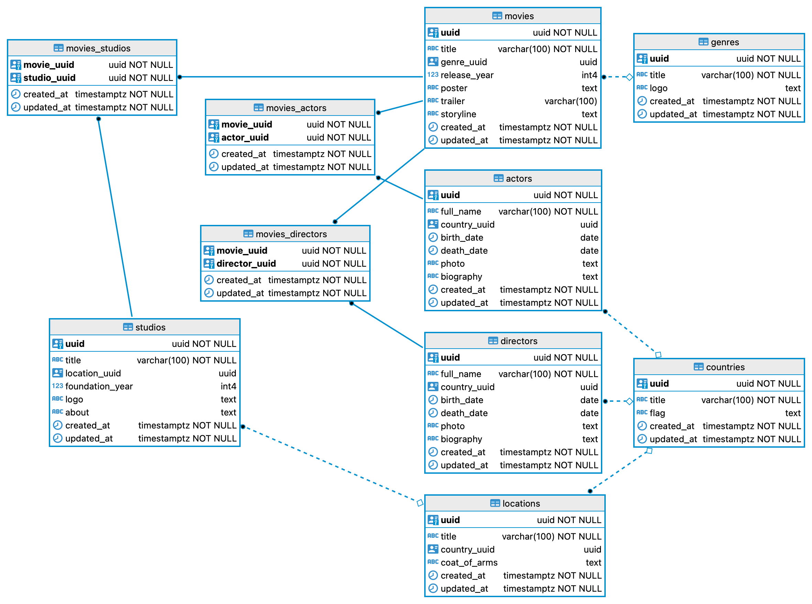

# Cinema Manager

<p align="center">
  
</p>
<p align="center">
  
</p>

## Project Description

<strong>Cinema Manager</strong> — is a project that implements the ability to store and organize information about movies, actors, directors, and studios. It allows users to store and view information about actors and directors, as well as view movie storylines and trailers.

<details>
  <summary><strong>Main functionality of the application</strong></summary>

- **CRUD Operations**: Full Create, Read, Update, and Delete functionality for main and second entities.

- **Form Handling**: Dynamic forms with validation using Yup and Formik.

- **Pagination**: Efficient data management with paginated lists.

- **Responsive Design**: Optimized for both desktop and mobile devices.

- **Dark Theme**: Stylish dark theme for a modern look and feel.

- **Carousel Component**: Showcase movie posters with a carousel component.

- **Error Handling**: User-friendly error messages and notifications.

- **Localization**: Support for multiple locations and nationalities.

</details>

<details>
  <summary><strong>App screenshots</strong></summary>


</details>

## Technologies and Libraries

<details>
  <summary><strong>Server Technologies</strong></summary>

- **date-fns** – a library for formatting, calculating, and manipulating dates.
- **cors** – middleware for managing Cross-Origin Resource Sharing (CORS) policies.
- **dotenv** – library for loading environment variables from a `.env` file.
- **express** – web framework for building server applications in Node.js.
- **http-errors** – utility to create HTTP errors for Express error handling.
- **pg** – PostgreSQL client for Node.js, used by Sequelize to connect to the database.
- **pg-hstore** – module for serializing and deserializing JSON data in PostgreSQL.
- **sequelize** – ORM for PostgreSQL that supports models, migrations, and seeding.
- **yup** – schema builder for validating and parsing data on the server side.

</details>

<details>
  <summary><strong>Client Technologies</strong></summary>

- **@emotion/react** – library for writing CSS styles with JavaScript using the Emotion CSS-in-JS framework.
- **@emotion/styled** – styled-components API for Emotion, allowing styled React components.
- **@mui/icons-material** – Material UI icons library for React.
- **@mui/material** – core components library of Material UI for React.
- **@mui/system** – low-level utility for building custom design systems with Material UI’s styling engine.
- **@mui/x-date-pickers** – Material UI date and time picker components.
- **@reduxjs/toolkit** – official Redux tools and best practices to simplify Redux development.
- **axios** – promise-based HTTP client for making requests to APIs.
- **date-fns** – modern JavaScript date utility library for parsing, formatting, and manipulating dates.
- **formik** – form management library for React to handle form state, validation, and submission.
- **react** – core library for building user interfaces with components.
- **react-dom** – React package for interacting with the DOM.
- **react-player** – React component for playing media from various sources like YouTube, Vimeo, etc.
- **react-redux** – official React bindings for Redux to connect React components with the Redux store.
- **react-router-dom** – routing library for React to handle navigation and routing in web apps.
- **redux-logger** – middleware for logging Redux actions and state changes to the console.
- **swiper** – modern mobile touch slider library with React support.
- **yup** – JavaScript schema builder for value parsing and validation, often used with Formik.

</details>

<details>
  <summary><strong>Common Dev Dependencies for Client and Server</strong></summary>

- **@eslint/js** – official ESLint JavaScript parser and utils.
- **@types/react** – TypeScript type definitions for React (used for editor support, no runtime effect).
- **@types/react-dom** – TypeScript type definitions for React DOM.
- **ESLint** – a tool for analyzing code to help follow best programming practices.
- **ESLint Config Prettier** – ESLint configuration for compatibility with Prettier.
- **ESLint Plugins**:
  - **eslint-plugin-import** – checks correctness of module imports.
  - **eslint-plugin-jsx-a11y** – helps improve accessibility in JSX code.
  - **eslint-plugin-mui-path-imports** – enforces correct import paths for MUI components.
  - **eslint-plugin-mui-sx-order** – ensures best practice ordering of MUI `sx` properties.
  - **eslint-plugin-optimize-regex** – optimizes regular expressions.
  - **eslint-plugin-prettier** – integrates Prettier with ESLint.
  - **eslint-plugin-promise** – enforces best practices when working with promises.
  - **eslint-plugin-react** – linting rules specific to React code.
  - **eslint-plugin-react-hooks** – checks correct usage of React hooks.
  - **eslint-plugin-react-perf** – detects inefficient patterns in React components.
  - **eslint-plugin-react-refresh** – supports React Fast Refresh.
  - **eslint-plugin-simple-import-sort** – automatically sorts imports.
  - **eslint-plugin-sort-keys-fix** – automatically sorts object keys.
  - **eslint-plugin-unicorn** – a set of rules for improving code quality.
- **Globals** – a set of global variables for proper ESLint operation.
- **Prettier** – a tool for automatic code formatting.
- **Vite** – build tool providing fast development and code optimization.
- **Vite Plugin Env Compatible** – ensures environment variable compatibility in Vite.
- **@vitejs/plugin-react** – official plugin to support React in Vite.

</details>

## Database schemas

<details>
  <summary><strong>PostgreSQL</strong></summary>
  <p align="center">
  
  </p>
</details>

## Project deployment

<details>
  <summary><strong>System requirements</strong></summary>

- **Git:** 2.47 or higher
- **Node.js:** 20.19.1 or higher
- **PostgreSQL:** 16.4 or higher

</details>

<details>
  <summary><strong>Preparing</strong></summary>

```bash
# Cloning the repository
git clone git@github.com:sytnikovzp/cinema-manager.git

# Go to the project directory
cd cinema-manager

# We install dependencies for the server and client parts
npm --prefix server install
npm --prefix client install
```

</details>

<details>
  <summary><strong>Setting configuration variables</strong></summary>

Create a file `.env` using the command:

```bash
cp .env.example .env
```

If the file `.env.example` **missing**, create a file `.env` using the command:

```bash
cat <<EOL > .env
# For client
VITE_PORT=3000

# For server
CLIENT_URL=http://localhost:3000
CINEMA_SERVER_HOST=localhost
CINEMA_SERVER_PORT=5000

# For database
DB_HOST=localhost
DB_DIALECT=postgres
DB_USER=postgres
DB_PASS=root
DB_NAME=cinema_manager
EOL
```

</details>

<details>
  <summary><strong>Database initialization</strong></summary>

```bash
cd server
npm run dbinit
cd ..
```

</details>

<details>
  <summary><strong>Starting the server side (BackEnd)</strong></summary>

```bash
# In a separate terminal, go to the project directory
cd cinema-manager

# Starting BackEnd
npm --prefix server start
```

</details>

<details>
  <summary><strong>Starting the client side (FrontEnd)</strong></summary>

```bash
# In a separate terminal, go to the project directory
cd cinema-manager

# Starting FrontEnd
npm --prefix client start
```

</details>

<details>
  <summary><strong>Completion of work</strong></summary>
  To stop the server or client part in the corresponding terminal, click:

```bash
CTRL + C
```

</details>

---

<p align="center">© 2024–2025 Alexandr Sytnikov. All rights reserved.</p>
